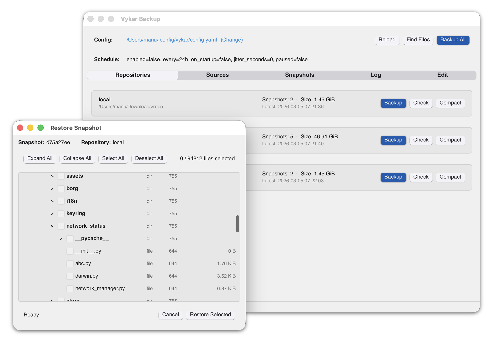

# V'Ger Backup

<p align="center">
  
</p>

A fast, encrypted, deduplicated backup tool written in Rust centered around a friendly YAML config file.

Inspired by [BorgBackup](https://github.com/borgbackup/borg/), [Borgmatic](https://torsion.org/borgmatic/), [Restic](https://github.com/restic/restic), and [Rustic](https://github.com/rustic-rs/rustic). V'Ger uses its own on-disk format and is not compatible with Borg or Restic repositories.

**⚠️ Don't use for production backups yet, but do test it along other backup tools.**

## Features

- **Deduplication** via FastCDC content-defined chunking
- **Compression** with LZ4 (default), Zstandard, or none
- **Encryption** with AES-256-GCM or ChaCha20-Poly1305 (auto-selected) and Argon2id key derivation
- **Storage backends** — local filesystem, S3-compatible storage, SFTP
- **YAML-based configuration** with multiple repositories, hooks, and command dumps
- **REST server** with append-only enforcement, quotas, and server-side compaction
- **Built-in WebDAV and desktop GUI** to browse and restore snapshots
- **Rate limiting** for CPU, disk I/O, and network bandwidth

## Quick start

```bash
curl -fsSL https://vger.pages.dev/install.sh | sh
```

Or download the latest release for your platform from the [releases page](https://github.com/borgbase/vger/releases).

```bash
# Generate a starter config and edit it
vger config

# Initialize the repository and run a backup
vger init
vger backup

# List snapshots
vger list
```

See the [full documentation](https://vger.borgbase.com) for storage backends, restore, maintenance, and more.


## Desktop UI

<p align="center">
  
</p>

`vger-gui` is a Slint-based desktop app that uses `vger-core` directly (it does not shell out to the CLI).

- Run backups on demand
- List snapshots and browse snapshot contents
- Extract snapshot contents
- Run in the system tray with periodic background backups
- Uses `vger.yaml` as the source of truth and auto-reloads config changes

Periodic GUI scheduling is configured in `vger.yaml` via:

```yaml
schedule:
  enabled: true
  every: "24h"
  on_startup: false
  jitter_seconds: 0
  passphrase_prompt_timeout_seconds: 300
```

## License

GNU General Public License v3.0
