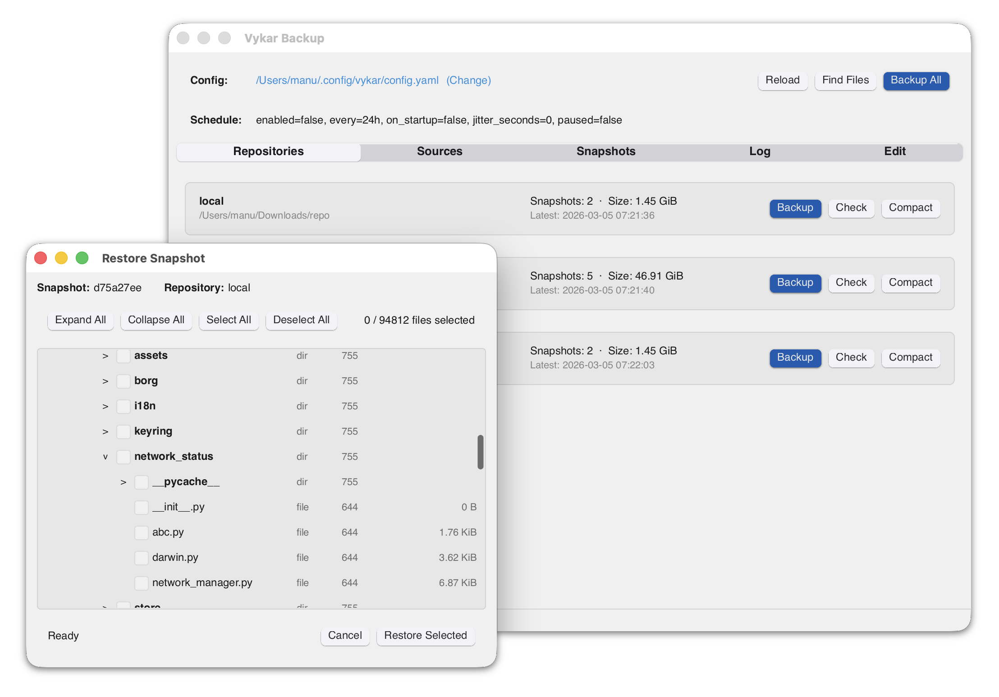

# Desktop GUI

Vykar includes a desktop GUI for managing repositories, running backups, and browsing/restoring snapshots. It is built with [Slint](https://slint.dev/) and [tray-icon](https://github.com/nickelpack/tray-icon).

[](images/gui-screenshot.png)

## Installing

### macOS

A signed app bundle (`Vykar Backup.app`) is included in the release archive. Download the latest release from the [releases page](https://github.com/borgbase/vykar/releases), extract it, and drag the app to your Applications folder.

### Linux

The Intel glibc release builds include the `vykar-gui` binary. Download the appropriate archive from the [releases page](https://github.com/borgbase/vykar/releases) and place the binary on your `PATH`.

You may need the `libxdo3` package at runtime:

```bash
# Debian/Ubuntu
sudo apt install libxdo3
```

To build from source, also install the development headers:

```bash
sudo apt install libxdo-dev
cargo build --release -p vykar-gui
```

The binary is at `target/release/vykar-gui`.

### Windows

The GUI is included in the Windows release archive. Download the latest release from the [releases page](https://github.com/borgbase/vykar/releases) and extract `vykar-gui.exe`.
