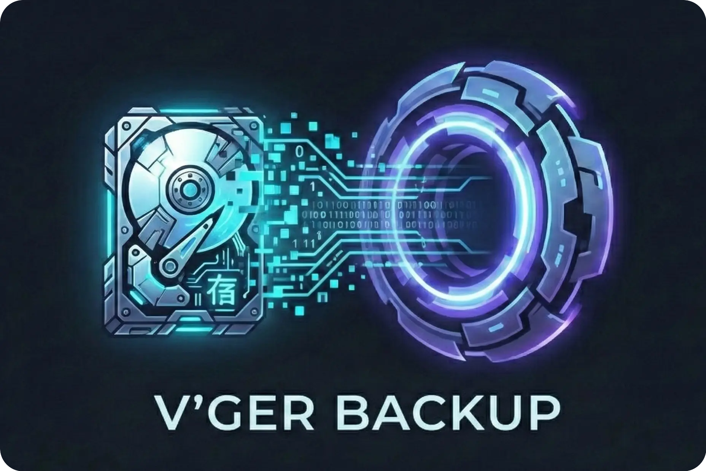

# V'Ger Backup Documentation

  

V'Ger is a fast, encrypted, deduplicated backup tool written in Rust. It's based on a simple YAML config format and includes a desktop GUI and webDAV server to view snapshots.

## Features

- **Deduplication** via FastCDC content-defined chunking
- **Compression** with LZ4 (default), Zstandard, or none
- **Encryption** with auto-selected AES-256-GCM or ChaCha20-Poly1305 and Argon2id key derivation
- **Storage backends** via Apache OpenDAL (local filesystem, S3-compatible storage, SFTP)
- **Dedicated REST server** with append-only enforcement, quotas, and server-side compaction
- **Built-in web interface** (WebDAV) to browse and restore snapshots
- **YAML-based configuration** with environment variable expansion
- **Rate limiting** for CPU, disk I/O, and network bandwidth
- **Hooks** for monitoring, database backups, and custom scripts
- **Desktop GUI** (work in progress)

## Inspired by

- [BorgBackup](https://github.com/borgbackup/borg/): architecture, chunking strategy, repository concept, and overall backup pipeline.
- [Borgmatic](https://torsion.org/borgmatic/): YAML configuration approach.
- [Rustic](https://github.com/rustic-rs/rustic): storage backend abstraction via Apache OpenDAL, pack file design, and architectural references from a mature Rust backup tool.

## Comparison

| Aspect | Borg | Restic | Rustic | vger |
|--------|------|--------|--------|------|
| Language | Python + Cython | Go | Rust | Rust |
| Chunker | Buzhash (custom) | Rabin | Rabin (Restic-compat) | FastCDC |
| Encryption | AES-CTR+HMAC / AES-OCB / ChaCha20 | AES-256-CTR + Poly1305-AES | AES-256-CTR + Poly1305-AES | AES-256-GCM / ChaCha20-Poly1305 (auto-select at init) |
| Key derivation | PBKDF2 or Argon2id | scrypt | scrypt | Argon2id |
| Serialization | msgpack | JSON + Protocol Buffers | JSON + Protocol Buffers | msgpack |
| Storage | borgstore + SSH RPC | Local, S3, SFTP, REST, rclone | OpenDAL (local, S3, many more) | OpenDAL (local, S3) + vger-server |
| Repo compatibility | Borg v1/v2/v3 | Restic format | Restic-compatible | Own format |

## Usage

- [Installing](install.md)
- [Initialize and Set Up a Repository](init-setup.md)
- [Storage Backends](backends.md)
- [Make a Backup](backup.md)
- [Restore a Backup](restore.md)
- [Maintenance](maintenance.md)

## Reference

- [Configuration](configuration.md)
- [Command Reference](commands.md)
- [Server Mode](server-mode.md)
- [Architecture](architecture.md)
