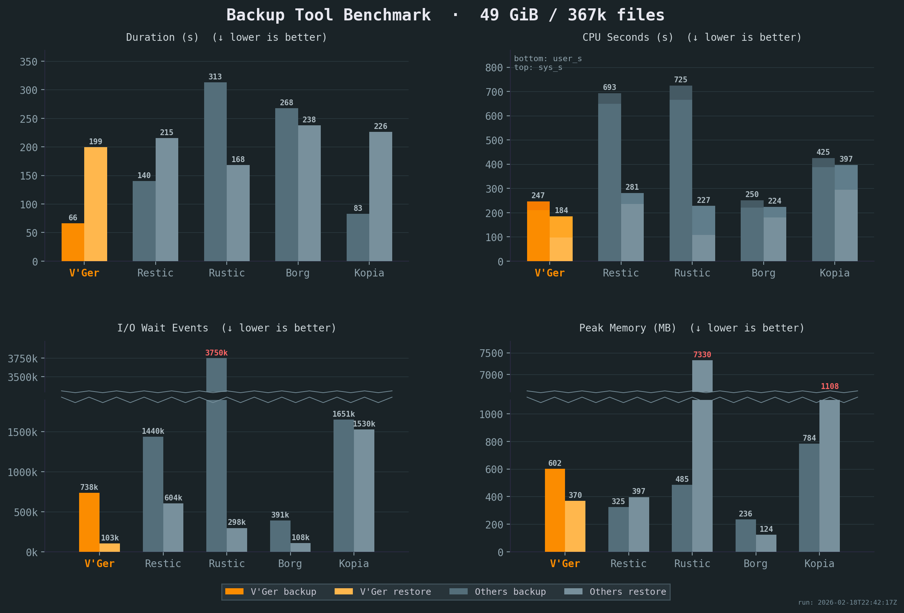

  

V'Ger is a fast, encrypted, deduplicated backup tool written in Rust. It's centered around a simple YAML config format and includes a desktop GUI and webDAV server to browse snapshots. More about [design goals](goals.md).

**⚠️ Don't use for production backups yet, but do test it along other backup tools.**

## Features

- **Deduplication** via FastCDC content-defined chunking with a memory-optimized engine (tiered dedup index + mmap-backed pack assembly)
- **Compression** with LZ4 (default), Zstandard, or none
- **Encryption** with AES-256-GCM or ChaCha20-Poly1305 (auto-selected) and Argon2id key derivation
- **Storage backends** — local filesystem, S3-compatible storage, SFTP
- **YAML-based configuration** with multiple repositories, hooks, and command dumps
- **REST server** with append-only enforcement, quotas, and server-side compaction
- **Built-in WebDAV and desktop GUI** to browse and restore snapshots
- **Rate limiting** for CPU, disk I/O, and network bandwidth

## Benchmarks

V'Ger achieves the best speed and throughput of any comparable backup tool, while using fewer CPU cycles.

<small>See our [e2e testing skill](https://github.com/borgbase/vger/blob/main/.claude/commands/e2e-tests/benchmarks.md) for full benchmark details. All benchmarks were run on the same Intel i7-6700 CPU @ 3.40GHz machine with 2x Samsung PM981 NVMe. Compression and resulting repository sizes comparable. Sample corpus is a mix of files including the Linux kernel, a Wikipedia dump and an Ubuntu ISO.</small>

## Comparison

| Aspect | Borg | Restic | Rustic | V'Ger |
|--------|------|--------|--------|------|
| Configuration | CLI (YAML via Borgmatic) | CLI (YAML via ResticProfile) | TOML config file | YAML config with env-var expansion |
| Browse snapshots | FUSE mount | FUSE mount | FUSE mount | Built-in WebDAV + web UI |
| Command dumps | Via Borgmatic (database-specific) | None | None | Native (generic command capture) |
| Hooks | Via Borgmatic | Via ResticProfile | Native | Native (per-command before/after) |
| Rate limiting | None | Upload/download bandwidth | — | CPU, disk I/O, and network bandwidth |
| Dedicated server | SSH (`borg serve`) | rest-server (append-only) | rustic_server | REST server with append-only, quotas, server-side compaction |
| Desktop GUI | Vorta (third-party) | Third-party (Backrest) | None | Built-in |
| Scheduling | Via Borgmatic | Via ResticProfile | External (cron/systemd) | Built-in |
| Language | Python + Cython | Go | Rust | Rust |
| Chunker | Buzhash (custom) | Rabin | Rabin (Restic-compat) | FastCDC |
| Encryption | AES-CTR+HMAC / AES-OCB / ChaCha20 | AES-256-CTR + Poly1305-AES | AES-256-CTR + Poly1305-AES | AES-256-GCM / ChaCha20-Poly1305 (auto-select at init) |
| Key derivation | PBKDF2 or Argon2id | scrypt | scrypt | Argon2id |
| Serialization | msgpack | JSON + Protocol Buffers | JSON + Protocol Buffers | msgpack |
| Storage | borgstore + SSH RPC | Local, S3, SFTP, REST, rclone | OpenDAL (local, S3, many more) | OpenDAL (local, S3, SFTP) + vger-server |
| Repo compatibility | Borg v1/v2/v3 | Restic format | Restic-compatible | Own format |

## Inspired by

- [BorgBackup](https://github.com/borgbackup/borg/): architecture, chunking strategy, repository concept, and overall backup pipeline.
- [Borgmatic](https://torsion.org/borgmatic/): YAML configuration approach, pipe-based database dumps.
- [Rustic](https://github.com/rustic-rs/rustic): storage backend abstraction via Apache OpenDAL, pack file design, and architectural references from a mature Rust backup tool.
- [V'Ger](https://memory-alpha.fandom.com/wiki/V%27Ger) from *Star Trek: The Motion Picture* — a probe that assimilated everything it encountered and returned as something far more powerful.

## Usage

- [Installing](install.md)
- [Initialize and Set Up a Repository](init-setup.md)
- [Storage Backends](backends.md)
- [Make a Backup](backup.md)
- [Restore a Backup](restore.md)
- [Maintenance](maintenance.md)

## Reference

- [Configuration](configuration.md)
- [Command Reference](commands.md)
- [Server Mode](server-mode.md)
- [Architecture](architecture.md)
