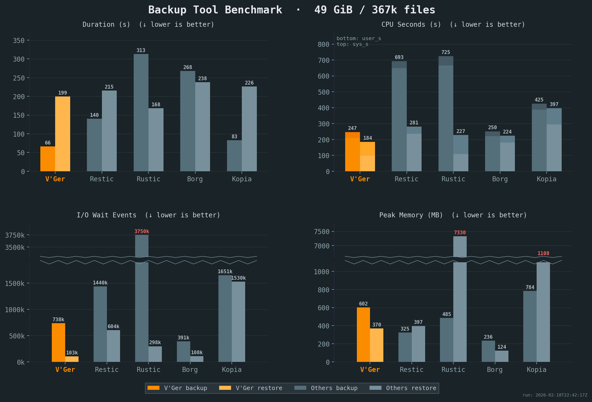

Vykar is a fast, encrypted, deduplicated backup tool written in Rust. It's centered around a simple YAML config format and includes a desktop GUI and webDAV server to browse snapshots. More about [design goals](goals.md).

**Do not use for production backups yet, but do test it along other backup tools.**

## Features

- **Storage backends** -- local filesystem, S3 (any compatible provider), SFTP, dedicated REST server
- **Encryption** with AES-256-GCM or ChaCha20-Poly1305 (auto-selected) and Argon2id key derivation
- **YAML-based configuration** with multiple repositories, hooks, and command dumps for monitoring and database backups
- **Deduplication** via FastCDC content-defined chunking with a memory-optimized engine (tiered dedup index plus local mmap-backed lookup caches)
- **Compression** with LZ4 or Zstandard
- **Built-in WebDAV and desktop GUI** to browse and restore snapshots
- **REST server** with append-only enforcement, quotas, and server-side compaction
- **Concurrent multi-client backups** -- multiple machines back up to the same repository simultaneously; only the brief commit phase is serialized
- **Built-in scheduling** via `vykar daemon` -- runs backup cycles on a configurable interval or cron schedule
- **Resource limits** for worker threads, backend connections, and upload/download bandwidth
- **Cross-platform** -- Linux, macOS, and Windows

## Benchmarks

Vykar is the fastest tool for both backup and restore, with the lowest CPU cost, while maintaining competitive memory usage.

<small>All benchmarks were run 5x on the same idle Intel i7-6700 CPU @ 3.40GHz machine with 2x Samsung PM981 NVMe drives, with results averaged across all runs. Compression settings were chosen to keep resulting repository sizes comparable. The sample corpus is a mix of small and large files with varying compressibility. See [detailed results](images/summary.json) or our [benchmark script](https://github.com/borgbase/vykar/tree/main/scripts) for full details.</small>

## Comparison

### Workflow & UX

| Aspect | Borg | Restic | Rustic | Kopia | Vykar |
|--------|------|--------|--------|-------|-------|
| Configuration | CLI (YAML via Borgmatic) | CLI (YAML via ResticProfile) | TOML config file | JSON config + CLI policies | YAML config with env-var expansion |
| Scheduling | Via Borgmatic | Via ResticProfile | External (cron/systemd) | Built-in (interval, cron) | Built-in (`vykar daemon`) |
| Storage | borgstore + SSH RPC | Local, S3, SFTP, REST, rclone | Local, S3, SFTP, REST | Local, S3, Azure, GCS, B2, SFTP, WebDAV, Rclone | Local, S3, SFTP, REST + vykar-server |
| Automation | Via Borgmatic (hooks + DB dumps) | Via ResticProfile (hooks only) | Native hooks | Native (before/after actions) | Native hooks + generic command capture |
| Restore UX | FUSE mount + Vorta (third-party) | FUSE mount + Backrest (third-party) | FUSE mount | FUSE mount or WebDAV + built-in UI | Built-in WebDAV + desktop GUI |
| Compression | LZ4, Zstd, Zlib, LZMA, None | Zstd, None | Zstd, None | Gzip, Zstd, S2, LZ4, Deflate, Pgzip | LZ4, Zstd, None |

### Repository Operations & Recovery

| Aspect | Borg | Restic | Rustic | Kopia | Vykar |
|--------|------|--------|--------|-------|-------|
| Concurrent backups | v1: exclusive; v2: shared locks | Shared locks for backup | [Lock-free](https://rustic.cli.rs/docs/commands/backup.html) | [Concurrent multi-client](https://kopia.io/docs/advanced/architecture/) | Session-based (commit serialized) |
| Repository access | SSH, append-only | rest-server, append-only | Via rustic-server | Built-in server with ACLs | REST server, append-only, quotas |
| Crash recovery | Checkpoints, rollback | Atomic rename | Atomic rename ([caveats](https://github.com/rustic-rs/rustic/discussions/1537)) | Atomic blobs ([caveats](https://github.com/kopia/kopia/issues/4305)) | Journals + two-phase commit |
| Prune / GC safety | Exclusive lock | Exclusive lock | Two-phase delete (23h) | Time-based GC (24h min) | Session-aware lock |
| Data verification | `check --repair`, full verify | `check --read-data`, repair | Restic-compat check | Verify + optional ECC | `check --verify-data`, server offload |

### Security Model

| Aspect | Borg | Restic | Rustic | Kopia | Vykar |
|--------|------|--------|--------|-------|-------|
| Crypto construction | [v1: AES-CTR + HMAC (E&M); v2: AEAD](https://borgbackup.readthedocs.io/en/stable/internals/security.html) | [AES-CTR + Poly1305 (E-t-M)](https://restic.readthedocs.io/en/stable/100_references.html#keys-encryption-and-mac) | AES-CTR + Poly1305 (Restic-compat) | [AES-GCM / ChaCha20 (AEAD)](https://kopia.io/docs/advanced/architecture/) | AES-GCM / ChaCha20 (AEAD, AAD) |
| Key derivation | v1: PBKDF2; v2: Argon2 | scrypt (fixed params) | scrypt (Restic-compat) | scrypt | Argon2id (tunable) |
| Content addressing | Keyed HMAC-SHA-256 / BLAKE2b | [SHA-256](https://restic.readthedocs.io/en/stable/100_references.html#backups-and-deduplication) | SHA-256 (Restic-compat) | Keyed hash (BLAKE2B-256-128 default) | Keyed BLAKE2b-256 MAC |
| Key zeroization | Python GC (non-deterministic) | Go GC (non-deterministic) | Rust `zeroize` | Go GC (non-deterministic) | `ZeroizeOnDrop` on all key types |
| Implementation safety | Python + C extensions | Go (GC, bounds-checked) | Rust (minimal unsafe) | Go (GC, bounds-checked) | Rust (minimal unsafe) |

<small>

**Crypto construction**: AEAD (Authenticated Encryption with Associated Data) provides confidentiality and integrity in a single pass. Encrypt-and-MAC (E&M) and Encrypt-then-MAC (E-t-M) are older two-step constructions. Domain-separated AAD binds ciphertext to its intended object type and identity, preventing cross-object substitution.

**Content addressing**: Keyed hashing prevents confirmation-of-file attacks, where an adversary who knows a file's content computes its expected chunk ID to confirm the file exists in the repository. Unkeyed hashing (plain SHA-256) does not prevent this.

**Key zeroization**: `ZeroizeOnDrop` overwrites key material in memory immediately when it goes out of scope. Garbage-collected runtimes (Go, Python) may leave key bytes in memory until the GC reclaims the allocation.

</small>

## Inspired by

- [BorgBackup](https://github.com/borgbackup/borg/): architecture, chunking strategy, repository concept, and overall backup pipeline.
- [Borgmatic](https://torsion.org/borgmatic/): YAML configuration approach, pipe-based database dumps.
- [Rustic](https://github.com/rustic-rs/rustic): pack file design and architectural references from a mature Rust backup tool.
- **Name**: From Latin *vicarius* ("substitute, stand-in") — because a backup is literally a substitute for lost data.

## Get Started

Follow the **[Quick Start guide](quickstart.md)** to install Vykar, create a config, and run your first backup in under 5 minutes.

Once you're up and running:

- [Configure storage backends](backends.md) -- connect S3, SFTP, or the REST server
- [Set up hooks and command dumps](configuration.md#hooks) -- run scripts before/after backups, capture database dumps
- [Browse and restore snapshots](restore.md) -- list, search, and restore files
- [Maintain your repository](maintenance.md) -- prune old snapshots, check integrity, compact packs
- [Explore backup recipes](recipes.md) -- common patterns for databases, containers, and filesystems
